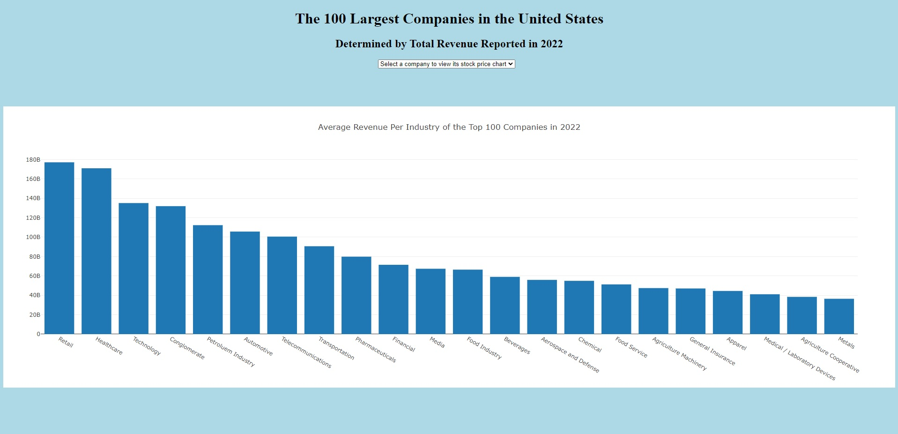

## 100 Largest Companies by Revenue in the United States for 2022
Python Flask-powered API, HTML/CSS, JavaScript, Leaflet, Plotly
### Jupyter notebook "exploration.ipynb" file reads, cleans, and uploads 2 files:
### 100 rows of company data from "data/largest_us_companies_2022.csv"  Source: Wikipedia - https://en.wikipedia.org/wiki/List_of_largest_companies_in_the_United_States_by_revenue
### 21586 rows of historical stock data from "data/stock_prices_2022.csv"  Source: Yahoo! Finance - https://finance.yahoo.com/lookup
### Two csv files are read into Python DataFrames. Data is cleaned by updating column names, splitting geo coordinates into separate latitude and longitude columns, and removing commas from integer fields. After creating the new tables in PostgreSQL, SQLAlchemy is used to upload the cleaned data into the two new tables.
### "app.py" creates multiple Python Flask-powered APIs for retrieving the data from PostgreSQL.
### "templates/index.html" is the starting page, in which the headquarters for the top 100 companies by revenue in the United States are displayed in a Leaflet Heat Map visualization. This map also accesses "static/js/leaflet-heat.js" and "static/css/style.css". The user can zoom aand/or scroll this map, or interact with a button to load the additional page.

### "templates/dashboard.html" renders the additional page, which contains two additional visualizations. The first is a Plotly bar chart showing the 2022 revenue, grouped by industry.

### The user can also interact by selecting a company from a dropdown, which will display the 2022 stock prices for that company via a Plotly line chart.

### This website uses a Flask app that accesses PostgreSQL and therefore can only be run locally at http://127.0.0.1:5000/, but a recorded presentation and slide deck are both available ("Largest US Companies.ppt" and "Largest US Companies.mp4").